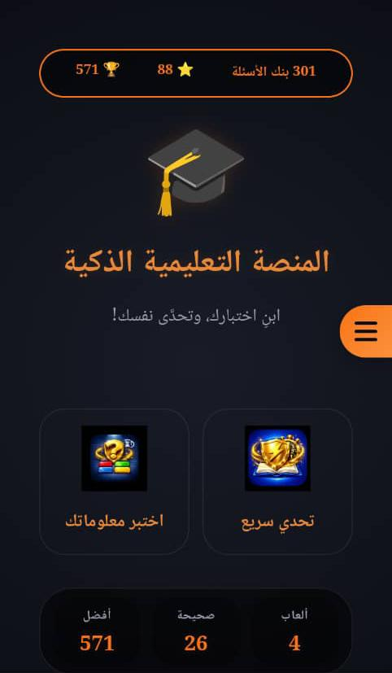
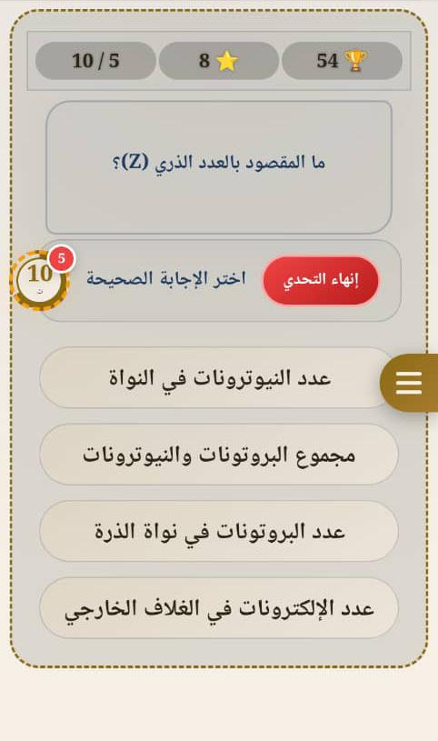
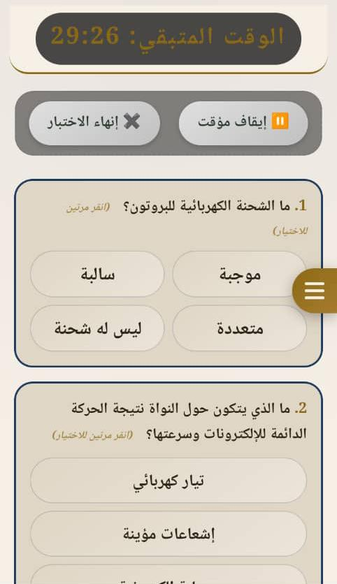

# 🎓 المنصة التعليمية الذكية (Smart Educational Platform)

[](https://github.com/gbrhomidi/Educational-platform)
[](LICENSE)
[](https://developer.mozilla.org/en-US/docs/Web/Progressive_web_apps)
[](https://web.dev/offline-first/)

منصة تعليمية تفاعلية تعمل **بدون إنترنت** (Offline-First)، مصممة لإنشاء وإدارة الاختبارات التعليمية بسهولة. تدعم المنصة الربط المباشر بين الأجهزة (P2P) لمشاركة بنك الأسئلة، مع واجهة مستخدم عصرية وأدوات تحليل متقدمة.

> **💡 ملاحظة:** هذا المشروع هو Fork من [Aktbar](https://github.com/gbrhomidi/Educational-platform) وقد تم تطويره وتحسينه بشكل كبير.

---

## 📱 الميزات الرئيسية

### 🎮 أنماط اللعب
| الميزة | الوصف |
|--------|-------|
| **تحدي سريع** | أسئلة متتالية مع مؤقت زمني، ومكافآت نجمية حسب سرعة الإجابة |
| **اختبار معلوماتك** | اختبار شامل مع تصحيح تلقائي ومراجعة الإجابات |
| **مراجعة الأسئلة** | عرض وتحليل الإجابات السابقة مع إحصائيات الأداء |

### 📚 إدارة المحتوى
- **إضافة/تحرير/حذف الأسئلة** مع دعم الصور
- **تصنيف الأسئلة** حسب المادة أو الوحدة الدراسية
- **تحديد نطاق الوحدات والدروس** لكل اختبار
- **استيراد وتصدير الأسئلة** بصيغة JSON
- **استيراد تلقائي من نصوص PDF** عبر نماذج الذكاء الاصطناعي (ChatGPT/Claude)

### 🌐 الشبكة والمشاركة
- **مشاركة بنك الأسئلة** عبر رمز QR
- **اتصال مباشر بين الأجهزة** (WebRTC P2P)
- **وضع الأستاذ** (إنشاء غرفة وإدارة الطلاب)
- **وضع الطالب** (الاتصال بغرفة الأستاذ)
- **مزامنة الإعدادات** بين الأجهزة المتصلة

### 🏆 الإنجازات والإحصائيات
- **نظام XP ومستويات** (مبتدئ → طالب → محترف → خبير → عبقري → أسطورة)
- **جوائز وإنجازات** (أول سؤال، أول اختبار، درجة كاملة، إلخ)
- **إحصائيات تفصيلية** (عدد الألعاب، الإجابات الصحيحة، أفضل سلسلة انتصارات)
- **تسجيل تاريخ الألعاب** والمراجعات

### 🎨 التخصيص
- **12 سمة لونية** احترافية (الفحمي الذهبي، الياقوت الذهبي، الجمشتي الذهبي، إلخ)
- **الوضع الداكن/الفاتح** مع حفظ التفضيلات
- **دعم اللغة العربية والإنجليزية**
- **التحكم في الصوت** (مؤثرات صوتية، نطق الأسئلة)
- **تخصيص المؤقتات** (وقت لكل سؤال، عدد الأسئلة، مدة الاختبار)

---

## 📸 لقطات الشاشة

| الشاشة الرئيسية | وضع التحدي السريع | وضع الاختبار |
|-----------------|-------------------|--------------|
|  |  |  |

---

## 🛠️ التقنيات المستخدمة

| التقنية | الاستخدام |
|---------|-----------|
| **HTML5 / CSS3 / JavaScript** | التطبيق الأساسي |
| **PWA (Progressive Web App)** | العمل بدون إنترنت، التثبيت على الأجهزة |
| **IndexedDB (Dexie.js)** | تخزين البيانات محلياً |
| **WebRTC** | الاتصال المباشر بين الأجهزة (P2P) |
| **QRCode.js** | إنشاء رموز QR لمشاركة البيانات |
| **Web Audio API** | المؤثرات الصوتية والنطق |
| **LocalStorage** | حفظ الإعدادات والتفضيلات |
| **Service Worker** | دعم العمل بدون إنترنت |

---

## 🚀 كيفية التثبيت والتشغيل

### المتطلبات الأساسية
- متصفح حديث (Chrome، Edge، Firefox، Safari)
- دعم IndexedDB و Service Worker

### خطوات التثبيت

1. **نسخ المستودع**
   ```bash
   git clone https://github.com/gbrhomidi/Educational-platform.git
   cd Educational-platform
```

2. تشغيل التطبيق محلياً
   · استخدم أي خادم HTTP (مثل Live Server في VS Code)
   · أو افتح الملف index.html مباشرة في المتصفح
3. التثبيت كتطبيق PWA (اختياري)
   · على الأندرويد: من Chrome → أضف إلى الشاشة الرئيسية
   · على iOS: من Safari → مشاركة → أضف إلى الشاشة الرئيسية

---

📖 دليل الاستخدام

🔹 الشاشة الرئيسية

· تحدي سريع: اختر تصنيفاً، ثم نطاق وحدات ودروس، وابدأ التحدي
· اختبر معلوماتك: اختبار كامل مع تصحيح تلقائي وإمكانية مراجعة الإجابات
· القائمة الجانبية: (☰) تحتوي على جميع أدوات التطبيق

🔹 إدارة الأسئلة

1. من القائمة الجانبية اختر إدارة الأسئلة
2. أضف تصنيفاً جديداً أو اختر تصنيفاً موجوداً
3. أضف أسئلة جديدة مع:
   · نص السؤال
   · الإجابة الصحيحة
   · 3 إجابات خاطئة
   · الوحدة والدرس (رقمياً)
   · مستوى الصعوبة (A, B, C, D)
   · صورة توضيحية (اختياري)

🔹 استيراد الأسئلة من كتاب PDF

1. من القائمة الجانبية → إدارة الأسئلة
2. اختر كيفية الاستيراد لنسخ البرومبت المناسب
3. أرسل البرومبت مع ملف PDF إلى ChatGPT أو Claude
4. انسخ الناتج واحفظه كملف .json أو .txt
5. اختر استيراد أسئلة وحدد الملف
6. اختر التصنيف المستهدف أو أنشئ تصنيفاً جديداً

🔹 مشاركة بنك الأسئلة عبر QR

1. من القائمة الجانبية → إدارة الأسئلة
2. اختر تصنيفاً من القائمة المنسدلة
3. اضغط مشاركة QR
4. امسح الرمز من جهاز آخر للاستيراد

🔹 الاتصال الشبكي (P2P)

1. من القائمة الجانبية → الشبكة
2. الأستاذ: اضغط "وضع الأستاذ" لإنشاء غرفة
3. الطالب: اضغط "وضع الطالب" وأدخل رمز الغرفة
4. شارك البيانات والإعدادات بين الأجهزة

---

⚙️ الإعدادات المتقدمة

الإعداد الوصف
مستوى الصعوبة سهل، متوسط، صعب، تحليلي
الوقت لكل سؤال 5-60 ثانية (افتراضي 15)
عدد الأسئلة 0 = الكل، أو عدد محدد
حد الأخطاء 0 = بدون حد، أو 1-5 أخطاء
مدة الاختبار 5-120 دقيقة (افتراضي 30)
كتم الصوت تعطيل جميع المؤثرات الصوتية
الوضع الداكن تبديل المظهر الداكن/الفاتح
اللغة العربية / الإنجليزية
السمة اللونية 12 سمة احترافية

---

📂 هيكل المشروع

```
Educational-platform/
├── index.html                 # الصفحة الرئيسية
├── manifest.json              # إعدادات PWA
├── sw.js                      # Service Worker
├── package.json               # معلومات المشروع
├── assets/
│   ├── icons/                 # أيقونات التطبيق
│   ├── sounds/                # المؤثرات الصوتية
│   ├── fonts/                 # الخطوط المستخدمة
│   └── screenshots/           # لقطات الشاشة
├── css/
│   ├── style.css              # الأنماط الرئيسية
│   ├── themes.css             # الثيمات اللونية
│   └── animations.css         # مكتبة الأنيميشن
├── js/
│   ├── app.js                 # نقطة الدخول الرئيسية
│   ├── ui.js                  # التحكم بواجهة المستخدم
│   ├── game.js                # محرك اللعبة
│   ├── db.js                  # طبقة قاعدة البيانات
│   ├── network.js             # الاتصال الشبكي (WebRTC)
│   ├── translations.js        # نظام الترجمة
│   ├── theme-manager.js       # إدارة الثيمات
│   ├── audio.js              # مدير الصوتيات
│   ├── achievements.js        # نظام الإنجازات
│   ├── splash.js             # شاشة الترحيب
│   ├── constants.js          # الثوابت
│   ├── error-handler.js      # معالجة الأخطاء
│   ├── question-validator.js # التحقق من صحة الأسئلة
│   ├── adaptive-ai.js        # الذكاء الاصطناعي التكيفي
│   ├── app-version.js        # إدارة الإصدارات
│   └── store.js              # إدارة الحالة الموحدة
└── libs/
    ├── dexie.min.js          # IndexedDB ORM
    ├── confetti.browser.min.js # تأثيرات الاحتفال
    └── qrcode.min.js         # إنشاء رموز QR
```

---

🤝 المساهمة

نرحب بجميع المساهمات! يرجى اتباع الخطوات التالية:

1. Fork المشروع
2. أنشئ فرعاً جديداً (git checkout -b feature/amazing-feature)
3. أجرِ تغييراتك (git commit -m 'Add some amazing feature')
4. ادفع إلى الفرع (git push origin feature/amazing-feature)
5. افتح Pull Request

---

📞 التواصل

الوسيلة الرابط
واتساب 00967781038203
فيسبوك jbr.mhdy.alhmydy
البريد الإلكتروني db7r01@gmail.com

---

🙏 الشكر والتقدير

صدقة جارية لروح أبي وأمي - اللهم اجعلهم في الفردوس الأعلى 🤲

---

📄 الترخيص

هذا المشروع مرخص تحت رخصة ISC - راجع ملف LICENSE للتفاصيل.

---

⭐ دعم المشروع

إذا أعجبك المشروع، لا تنسى منحه ⭐ نجمة على GitHub!

---

تم التطوير بواسطة: المهندس / جبر الحميدي
الإصدار: 3.0.0
تاريخ الإصدار: 2025-06-01
